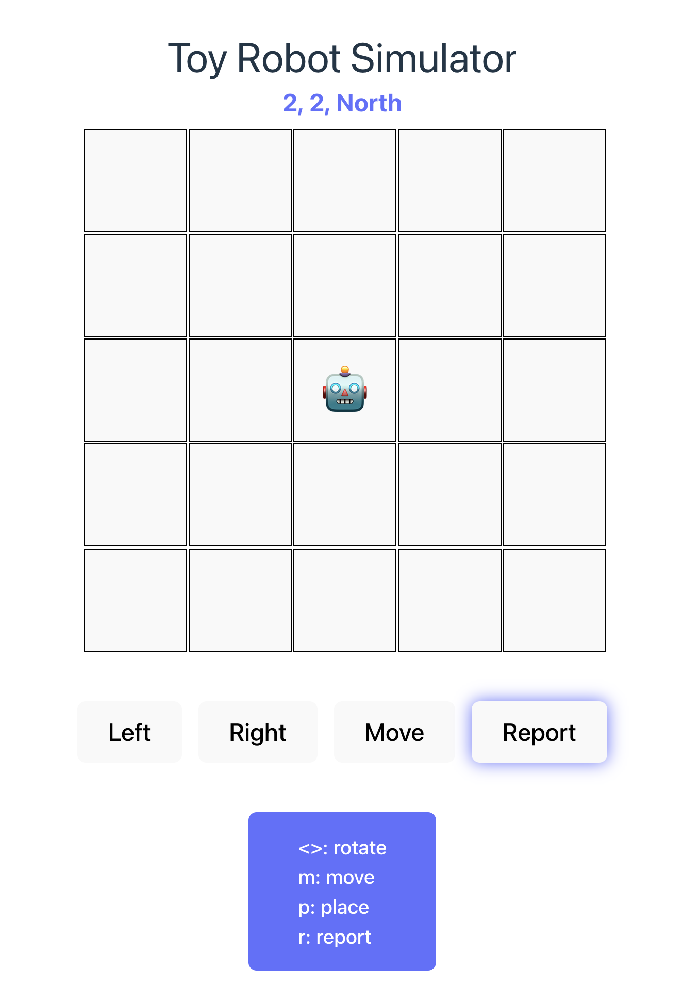

# Toy Robot Simulator

Use buttons or keyboard controls to move and rotate a robot on a grid, and report its position and direction.

**Tech stack**: React, TypeScript, React Testing Library, Jest

